# 영상 업로드·열람·관리 아키텍처

현재 구현 기준 · 2026-09-17 포인트 전용 운영 반영

**사용자와 관리자는 같은 영상 원본을 권한에 따라 봅니다. 영상 파일은 비공개 Hugging Face Bucket에, 소유자·상태·동의·검수·포인트 정보는 운영 DB에 저장합니다.**

## 1. 전체 구조



| 구성 요소 | 하는 일 |
|---|---|
| 사용자 화면 `/studio/` | 파일 선택·제출, 본인 영상 목록·재생, 심사 결과·포인트 내역 확인 |
| 관리자 화면 `/admin/` | 전체 회원의 영상 조회, 원본 검수, 승인·반려, 구간 라벨, 삭제·포인트 관리 |
| Vercel `/api/...` | 사용자·관리자의 같은 도메인 요청을 비공개 운영 서버에 전달. 서버용 인증과 요청 출처 검사 |
| Firebase | Google 신원과 가입 기록 확인. 운영 계정의 관리자 역할은 별도 서버 데이터로 관리 |
| 비공개 HF Space | 소유권·관리자 권한 검사, 영상 처리, 심사·보상·삭제 규칙 실행 |
| 운영 SQLite | 회원, 영상 소유자와 상태, 동의, 심사 이력, 라벨, 보상·출금·감사 기록 |
| 비공개 HF Bucket | 업로드 조각, 최종 원본, 암호화된 SQLite 체크포인트 보관 |

브라우저에는 HF API 키나 S3 키를 전달하지 않습니다. 원본 재생도 `/api/videos/:id/file`을 거쳐 권한을 검사하며, 필요한 구간을 Range 요청으로 읽습니다. 다른 사용자는 영상 URL을 알아도 타인의 원본을 열람할 수 없습니다.

## 2. 사용자가 영상을 올리면

1. **계정 확인:** Google 신원과 가입 기록을 검증하고 운영 세션을 연결합니다. 관리자 권한은 명시적으로 승인된 계정에만 부여합니다.
2. **제출 준비:** 활동 8개 중 하나, 제목, MP4/WebM 파일을 선택하고 촬영·개인정보·이용·교육 동의와 대한민국 내 직접 촬영 여부를 확인합니다. 국내 촬영은 제출자의 자기 확인이며 위치 인증은 아닙니다. 현재 파일 한도는 500 MiB입니다.
3. **조각 전송:** `POST /uploads`로 업로드 번호를 만든 뒤 약 2 MB인 **2 MiB** 단위로 전송합니다. 조각은 Bucket의 `staging/`에 저장하고 받은 위치·크기·해시는 DB에 기록합니다.
4. **원본 확정:** 서버가 조각을 순서대로 합치고, 실제 파일 형식·크기·길이·해상도 및 같은 사용자의 SHA-256 중복을 확인합니다. 최종 원본을 `videos/vid_id`에 저장하고 `videos` 레코드를 만듭니다. 상태는 `uploaded`입니다.
5. **심사 접수:** 일반 제출 폼은 바로 `/videos/:id/submit`을 호출합니다. 동의와 제출 시각을 저장하고 `submitted`로 바꿉니다. 이 시점부터 실제 심사 대상입니다.
6. **저장 확인:** 운영 기록을 일관된 암호화 체크포인트로 저장한 뒤 성공 응답을 보냅니다. 저장 성공 여부가 불확실하면 성공으로 표시하지 않고 서버 요청을 제한합니다.

업로드 완료와 심사 접수는 별도 API 단계입니다. 원본 업로드까지만 성공하고 제출 요청이 실패하면 `uploaded` 영상이 남을 수 있고, 사용자가 `제출하기`로 다시 접수할 수 있습니다.

현재 브라우저 UI는 네트워크 실패 때 남은 업로드를 정리하고 실패를 알립니다. 서버에 조각·오프셋 정보가 있더라도 **화면의 자동 이어 올리기는 아직 제공하지 않습니다.**

## 3. 사용자가 보는 구조

| 화면 | 저장 위치·범위 | 사용자가 하는 일 |
|---|---|---|
| **보관한 영상** `#library` | 해당 브라우저의 로컬 파일·기록 | 파일 가져오기, 로컬 재생·수정·삭제. 다른 기기와 자동 동기화되지 않음 |
| **영상 제출** | 선택한 파일을 계정의 서버 영상으로 업로드 | 로컬 보관 파일 또는 기기 파일 선택. 기존 로컬 기록은 그대로 유지 |
| **제출·심사** `#reviews` | 서버에서 `videos.userId`로 조회한 본인 영상 | 목록·상태, 원본 재생, 상세·심사 결과 확인 |
| **영상·상세** | 원본과 연결된 서버 기록 | 원본, 제목, 상태, 길이·용량, 심사 회차·시각·사유 확인 |
| **포인트** `#wallet` | 승인 포인트 원장 | 보유 포인트·승인 대기 예상치·적립 내역 확인. 국내 은행 연동 전까지 계좌 등록·출금은 비활성 |

**로컬 보관함에 넣는 것만으로 서버에 제출되지는 않습니다.** 로컬 상태나 과거 시연 기록은 실제 심사·정산으로 계산하지 않습니다. 실제 제출 영상은 서버 계정에 연결되어 다른 기기에서도 같은 계정으로 조회할 수 있습니다.

미제출(`uploaded`) 영상의 본인 삭제 API는 있지만, 현재 온라인 화면에는 직접 삭제 버튼이 없습니다. 화면에서 서버 영상 삭제가 필요하면 운영자에게 문의합니다. 로컬 보관함의 삭제는 해당 브라우저 기록에만 적용됩니다. 반려 영상에는 같은 원본의 재검토 요청과 새 수정 영상 업로드가 있습니다. 같은 원본의 재제출은 기존 영상 ID를 유지하며 제출 회차(`revision`)를 올립니다.

## 4. 관리자에서 보고 처리하는 구조



| 단계 | 관리자 화면과 동작 | 저장되는 결과 |
|---|---|---|
| 찾기 | 대시보드의 심사 대기 → `영상·심사`. 회원·활동·상태 등으로 검색·필터 | 여러 사용자의 영상 레코드를 권한 있는 관리자에게 조회 |
| 열기 | 원본 플레이어, 제목, 길이·해상도, 활동 안내, 약속된 보상 확인 | 조회만으로 자동 승인·보상 발생 없음 |
| 검수 | 구도·손 가시성·개인정보·작업 완료 4개 기준 확인 | 체크 결과와 심사 회차 기록 |
| 판정 | `검토 중으로`, `승인`, `반려` 선택 | 상태 변경과 심사자·시각·사유를 `reviews`에 추가 |
| 라벨 | 시작·종료 시점과 작업 라벨 입력 | `annotations`에 구간 기록. 실제 영상 길이 범위 검사 |
| 추적·내보내기 | 동의 버전·시각, 심사 이력, JSON/CSV 등 확인 | 영상 메타데이터·동의·라벨·관리 기록 |
| 삭제 | 대상 영상과 삭제 사유 확인 후 원본 삭제 요청 | 삭제 작업·감사 기록을 먼저 저장하고 실제 파일 정리 |

`reviewing`은 관리자가 직접 선택할 때만 생깁니다. 접수된 영상을 열었다고 자동 전환되지는 않으며, `submitted`에서 바로 승인·반려할 수도 있습니다. 승인에는 4개 체크가 모두 필요하고, 반려에는 사유가 필요합니다. 변경된 회차에 대한 오래된 심사 요청은 거절해 충돌을 막습니다.

관리 목록은 현재 최신 영상 1,000개까지 불러오며, 검색·필터도 그 범위에 적용됩니다. 전체 회원에 대한 관리 권한과 모든 과거 기록을 무제한 조회하는 기능은 구분해야 합니다.

승인은 DB 트랜잭션에서 상태·검수 이력과 보상 원장을 함께 기록합니다. `ledger.reference = video.id`의 중복 제약으로 영상당 보상은 한 번만 적립됩니다. 현재 기본 활동은 검수 승인 시 3,000P가 적립됩니다. **현재는 포인트 적립만 운영합니다.** 출금 화면은 국내 은행 연동 예정으로 표시되며, 계좌 등록·출금·사용 요청은 화면과 서버 모두 비활성입니다. 현금 전환 비율과 제공 일정은 정해지지 않았습니다.

## 5. 영상 1개의 실제 저장 구조

```text
Hugging Face 비공개 Bucket: 60base/dongjakso-videos
├── staging/
│   └── up_업로드ID/
│       ├── 0                  # 첫 2 MiB 조각
│       ├── 2097152            # 다음 조각의 바이트 시작 위치
│       └── ...                # 완료·취소·만료 시 정리
├── videos/
│   └── vid_영상ID             # 원본 파일 바이트, 영상 ID당 한 개
└── system/
    └── checkpoint.bin         # 운영 DB + 복원에 필요한 키·메타데이터의 암호화 묶음

운영 DB: Space 로컬 SQLite, 위 checkpoint로 영구 보존
users.id ──< videos.userId
tasks.id ──< videos.taskId
videos.id ──< reviews.videoId           # 심사자·상태·사유·기준·회차·시각
videos.id ──< annotations.videoId       # 시작·종료·라벨
videos.id ─── ledger.reference          # 승인 보상 1회, UNIQUE
users.id ──< ledger.userId / payouts.userId
videos.id ─── cleanup_jobs.videoId      # 삭제 재시도 작업
audit                                   # 계정·영상·검수·정산 등의 변경 기록
```

`videos`에는 `id`, `userId`, `taskId`, 원본 경로(`path`), 파일명·형식·크기, 실제 길이·해상도, SHA-256, 상태, 동의, 제출 회차와 시각, 촬영 활동의 스냅샷(`captureTask`), 보상 등이 있습니다. 사용자와 관리자 화면은 이 레코드를 각각 본인 범위·전체 관리 범위로 조회하고 같은 원본에 접근합니다.

**원본 파일은 비공개로 보관하며, 애플리케이션이 별도로 암호화하는 것은 DB 체크포인트입니다.** 원본 파일까지 앱에서 암호화한다는 의미는 아닙니다.

## 6. 삭제와 장애가 생겼을 때

- 삭제는 `deleting → deleted`로 진행합니다. 삭제 작업을 먼저 기록하고 원본 정리에 실패하면 재시도합니다. 완료 후 원본 크기는 0으로 기록합니다.
- 관리자 삭제는 원본과 구간 라벨을 제거하지만 영상의 삭제 상태, 심사·동의·보상·정산 등 연결된 관리 이력이 남을 수 있습니다. 원본 삭제와 모든 개인정보·업무 이력의 완전 삭제는 서로 다른 범위입니다.
- 미완료 업로드는 만료 정리 대상입니다. 서버 기동 시와 주기적인 관리 작업에서 남은 조각·삭제 작업을 정리합니다.
- Space 재시작 시 Bucket의 체크포인트를 복원합니다. 오래된 서버가 최신 DB를 덮어쓰지 않도록 ETag 조건부 쓰기를 사용합니다.
- 현재 구조는 단일 운영 서버·SQLite와 암호화 스냅샷을 사용하는 규모입니다. AI 자동 검수, 자동 라벨링, 영상 트랜스코딩/HLS, 자동 은행 송금, 공개 Hugging Face Dataset 발행은 현재 흐름에 포함되어 있지 않습니다.

## 코드 근거

| 책임 | 현재 구현 |
|---|---|
| 화면별 온라인 연결·제출·상세·지갑 | [studio/online.js](../../studio/online.js) |
| 로컬 보관·재생·삭제 | [studio/local-records.js](../../studio/local-records.js) |
| 같은 도메인 API 중계·인증 | [api/operations.js](../../api/operations.js) |
| 소유권·업로드·제출·검수·보상 규칙 | [server/app.mjs](../../server/app.mjs) |
| 테이블·영상과 회원 관계·보상 중복 방지 | [server/database.mjs](../../server/database.mjs) |
| 조각·원본 저장·Range 재생 | [server/hf-media.mjs](../../server/hf-media.mjs) |
| 암호화 스냅샷·복원·충돌 방지 | [server/hf-state.mjs](../../server/hf-state.mjs) |
| 원본 삭제·재시도 | [server/media.mjs](../../server/media.mjs) |
| 관리자 목록·검수·라벨·정산 UI | [admin/admin.js](../../admin/admin.js) |

## 다이어그램 파일

| 그림 | Mermaid 원본 | 편집 원본 | 벡터 | 이미지 |
|---|---|---|---|---|
| 전체 구조 | [MMD](video-system.mmd) | [Excalidraw](video-system.excalidraw) | [SVG](video-system.svg) | [PNG](video-system.png) |
| 영상 상태·처리 흐름 | [MMD](video-lifecycle.mmd) | [Excalidraw](video-lifecycle.excalidraw) | [SVG](video-lifecycle.svg) | [PNG](video-lifecycle.png) |

Excalidraw 파일은 excalidraw.com의 **File → Open**에서 열어 도형·화살표·문구를 편집할 수 있습니다. 코드 변경이나 운영 데이터 조작 없이 현재 구현을 문서화했습니다.
